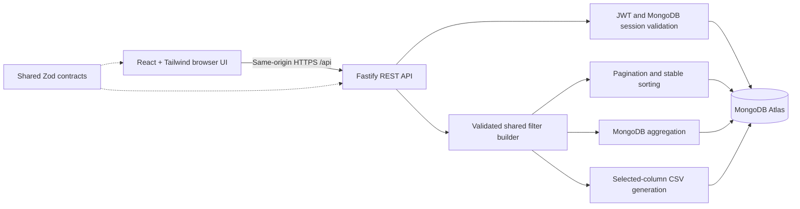

# Architecture

## Boundaries

- `apps/web`: presentation, URL view state, abortable requests, charts, export configuration. No database secrets or database driver.
- `apps/api`: HTTP/security configuration, authentication, query construction, aggregations, CSV generation, database access. Never trusts client totals or an unrestricted MongoDB query object.
- `packages/contracts`: runtime validators for incoming requests and dataset records, plus TypeScript response types. Does not expose database documents or password hashes.
- `data`: unchanged assignment JSON; the seed converts dates and monetary units explicitly.

## Query consistency

All transaction-consuming endpoints parse the same query contract and use `buildFilter`. Analytics ignores page and sort; export ignores page but respects sort. Therefore the scope of the dashboard and download matches the table filters. The table never computes global totals from its current page.

The frontend aborts obsolete requests and only commits a complete dashboard response for the current query. Search is debounced. View settings live in URL parameters. Heavy chart code loads separately from initial UI code.

## Persistence

Transactions have unique source IDs and an index on date/source ID for the default stable ordering. Users have unique email and application ID indexes. Sessions have a unique ID index and TTL expiry index. Request-time session expiry checks do not depend on the asynchronous TTL cleaner.

With 300 records, a modest scan for text search or an uncommon sort is appropriate. Additional compound indexes should follow measured query needs instead of indexing every field. Tests use real MongoDB in randomly named databases and delete only their own fixtures.

## Release model

One Azure App Service serves the built frontend and API. Atlas stays independent. The explicit release allowlist includes compiled artifacts, manifests, and lockfile, excluding environment files, sample data, and tests. CI checks the commit before release. Bicep, OIDC, health checks, and a versioned release artifact support repeatable operations. Deployment is pending by user choice.
