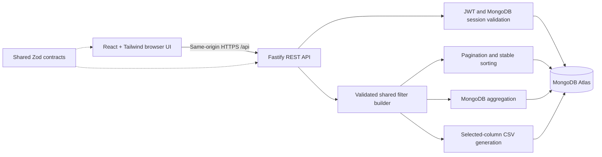

# Architecture and engineering decisions

## Boundaries

One npm-workspaces repository contains the frontend, API, and shared contracts. Fastify supplies routing, structured logging, and request injection for tests. The native MongoDB driver handles persistence; Zod validates inputs without maintaining a second set of ORM schemas.

- `apps/web`: presentation, URL view state, abortable requests, charts, export configuration. No database secrets or database driver.
- `apps/api`: HTTP/security configuration, authentication, query construction, aggregations, CSV generation, database access. Never trusts client totals or an unrestricted MongoDB query object.
- `packages/contracts`: runtime validators for incoming requests and dataset records, plus TypeScript response types. Does not expose database documents or password hashes.
- `data`: unchanged assignment JSON; the seed converts dates and monetary units explicitly.

## Query consistency

All transaction-consuming endpoints parse the same query contract and use `buildFilter`. Analytics ignores page and sort; export ignores page but respects sort. Therefore the scope of the dashboard and download matches the table filters. The table never computes global totals from its current page.

The frontend aborts obsolete requests and only commits a complete dashboard response for the current query. Search is debounced. View settings live in URL parameters. Heavy chart code loads separately from initial UI code.

React Router manages navigation and browser history. A session-scoped cache retains successful responses for 60 seconds (at most 40 entries); pagination reuses analytics when its filters are unchanged. Retry clears the cache. Previous results remain visible during refresh or failure, with exports disabled until the current query succeeds. Requests time out after 15 seconds, and authentication failures return to sign-in while preserving the destination URL. Chart and page error boundaries contain rendering failures.

## Persistence

Transactions have unique source IDs and an index on date/source ID for the default stable ordering. Users have unique email and application ID indexes. Sessions have a unique ID index and TTL expiry index. Request-time session expiry checks do not depend on the asynchronous TTL cleaner.

With 300 records, a modest scan for text search or an uncommon sort is appropriate. Additional compound indexes should follow measured query needs instead of indexing every field. Tests use real MongoDB in randomly named databases and delete only their own fixtures.

## Release model

The planned deployment uses one Azure App Service for the built frontend and API, with Atlas hosted separately. The release allowlist includes compiled artifacts, manifests, and the lockfile, excluding environment files, sample data, and tests. The manual deployment workflow runs checks before release and uses OIDC authentication. Cloud deployment and production smoke tests are pending.

Serving the frontend and API from one origin simplifies cookie authentication and keeps releases synchronized. Rate limiting is process-local; multiple application instances would need shared state. Azure proxy behavior and client IP attribution still need deployment verification.

## Financial rules

- Store nonnegative integer cents (`amountMinor`) and derive direction from Revenue/Expense.
- Use USD as a display assumption and UTC for dates. Date filters include the entire selected end day.
- Paid revenue minus paid expenses gives realized net cash flow. Pending incoming and outgoing amounts are reported separately.
- No opening balance or savings data is supplied, so net cash flow is not labeled as an account balance.
- The default view includes the supplied 2024 records rather than filtering to the current year.

## Identity and sessions

Registered analysts share the sample company dataset; accounts are not separate tenants. Source transaction user IDs are distinct from login accounts. Normalized emails have a unique index, and registration requires a separate login. Email verification and password recovery are outside the current scope.

Passwords use salted scrypt hashes. One-hour JWTs have a fixed algorithm, issuer, and audience, and are stored in an HttpOnly, SameSite=Strict cookie scoped to `/api` (Secure in production). MongoDB session records allow immediate logout revocation. Browser writes validate Origin and require a custom header; non-browser clients must also send the header.

## Practical limits

Offset pagination suits the 300-record dataset. CSV exports include all matching records, respect selected column order, and are bounded to 10,000 rows. Seed validates the full source before upserting; it is repeatable but not a multi-document transaction. Seeding never runs automatically at server startup.

The UI uses Tailwind utilities and self-hosted fonts. Sidebar pages extend the supplied dashboard: Wallet summarizes cash flow, Messages shows system notices, and Personal/Settings display account information and reporting defaults. Bank connections, transfers, chat, and account editing are outside scope.
